# 对复杂语义关系的排序学习

Na Chen
Viktor K. Prasanna
University of Southern California, USA

## 摘要
这篇文章基于用户的偏好在对复杂语义关系(语义关联)的研究上提出了创新的排序方法。我们的方法采用了一种排序学习的算法来捕获每个用户的偏好。通过这些偏好，它可以为用户定制个人化的排序函数。这个排序函数将在之后被用于对用户提出的每个询问子序列得到的结果进行排序。那些更加贴合用户偏好的结果将排名更靠前。我们的方法通过一个从Freebase linked-open-data数据集上创造出来的真实世界的RDF知识库来评价。实验结果显示该方法相较于state-of-the-art(目前最好的)方法，通过捕获用户偏好是的排序质量得到了有效提升。

##关键词

语义关联，复杂语义关系，排序学习，用户偏好，Freebase数据集，语义网

## 介绍
语义关系是本体的核心。它们通过含义连接了单词，条件和实体，并使得一个图能够表示丰富的语义知识。复杂语义关系，也被叫做语义关联(Aleman-Meza在2003年)，是链接了两个资源实体的一系列连续的属性；在RDF图上，它就是由一些连接两个实体结点的标号边组成的一条路径。语义关联挖掘是向着为了更好的一体化、研究和决策而获取有用语义信息迈进的至关重要的一步。已经有大量搜索技术和询问语言为了发掘语义关联而被开发出来，比如ρ-Queries(Anyanwu & Sheth, 2003)和SPARQLeR(Kochut & Janik, 2007)。一条语义关联查询包含一对实体，同时结果包含了所有它们之间的语义关联。

随着本体数量、规模和复杂性的快速增长，一对实体间的语义关联数量已经增长地极为快速。因此，一条语义关联搜索可能会返回太多结果，让用户无法消化。例如，我们将整个小说领域从Freebase linked-open-data (Google, 2011)中分离出来，并导入一个RDF知识库，就有192,000的资源点和411,000的属性边。我们观察这样一个知识库，发现即使是一个很简单的查询(例如 Harry Potter 和 James Potter)，同时给定了严格的路径长度限制(例如，10)，也得到了数以千计的语义关联。因此，为了区分出最相关的结果，我们需要一个行之有效的排序技术。

在语义关联排序方面，一个基本的挑战是理解用户的偏好。不同的用户在个人兴趣和搜索意图方面拥有不同的偏好。例如，图1是我们从Freebase data (Google, 2011)中创造出的一小部分RDF知识库。对于一个查询"找到Harry Potter和James Potter之间的语义关联"，表1给出了一些典型的搜索结果。在这些结果里，一个熟悉Harry Potter小说的用户会希望看到像结果4那样蕴含了更多信息的较复杂结果，但同时另一些对非凡力量这个主题感兴趣的人会希望结果5拥有更高的排名。考虑到这些偏好在现有的语义关联查询语言中并不能明确给出(Anyanwu & Sheth, 2003; Kochut & Janik, 2007)，我们更需要这些排序的手段来迎合每个个体用户的独特偏好。

许多已经被提出的个性化的语义关联排序方法都需要用户手动地去调整一些预先设定好的排序标准。例如，SemRank(Anyanwu et al., 2005) 提供了一个滑动条来让用户通过图形界面区分传统和发掘两种排序模式，又比如Aleman-Meza et al. (2005)的排序方法允许用户分配这两种度量标准的权重。然而，手动调整排序的度量标准是一个很微妙的任务，它需要可以想象的出的大量的时间和精力。此外，当查询结果的规模和复杂程度非常高的时候，手工调整实在是太困难了，而这种情况在大的知识库面前很常见。

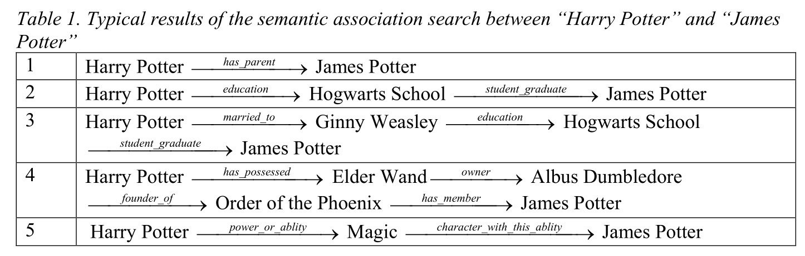

我们这项工作的目标是自动捕获用户的偏好，并且有效地利用这些偏好来个性化定制语义关联搜索结果。我们的方法基于一个概念，那就是使用这些语义关联搜索地用户才是最好的判断结果关联性的裁判。因此，用户对于这些结果的评价，作为用户特有的信息来说，是用户偏好最有价值的来源。在这篇文章里，我们使用了一种基于机器学习的排序方法来从用户对结果的评判里自动捕获他们的偏好。我们的方法为每位用户基于他们的偏好创造了一个个人化的排序函数。这个排序函数会在之后用来对用户的一系列查询获得的结果提高相关性。特别的，我们的方法允许每个用户通过给一些他喜欢的结果排名来对一些随机选择的小结果集合进行排序。每个语义关联结果都被一定数量的特征标记。我们使用一个基于SVM的排序学习模型，通过用户评价结果上的那些特征来捕获用户的偏好。

我们的主要贡献包括：

1. 据我们所知，我们的方法是第一个针对语义关联搜索结果排序的排序学习模型。它不需要任何手工调整，自动捕获了用户偏好并生成了个性化的排序结果。
2. 我们设计和实现了一个基于排序学习的语义关联搜索系统来对语义关联结果排序。我们通过在一个巨大的真实世界RDF知识库上的评估发现，我们的方法相较于最先进地方法，极大地提升了排序的质量。

## 相关工作

我们的工作和以下研究领域相关。

### 语义网排序

最近，大量的研究兴趣都指向了语义网上的排序知识。人们为了从本体，资源和关联三个层面定位这个问题做了许多努力。

在本体和资源层面上的排序，目的就是分别决定每个独立的本体和资源的相关性。例如，AKTiveRank (Alani et al., 2006)就基于在给定方向的表现将大量的分析手段应用于本体排序。Harth et.al (2009) and Ding et.al (2005) 用类似于 PageRank(Page et al., 1999) 的手段，通过分析资源间的链接和推荐来给他们排序。

恰恰相反的是，关联层面的排序是为了决定一对资源之间的语义关联的相关性，例如在介绍中提到的SemRank (Anyanwu et al., 2005) 和  (Aleman-Meza et.al, 2005) 中使用的方法。后者使用的方法早之后被Halaschek et.al (2004) 应用于一个很大的RDF元数据库。关联层面排序的另一个例子是NAGA (Kasneci et al., 2008) ，它用置信度，信息量和密度三个标准来给语义关系排序。NAGA采用了两个可以被人工配置的参数来获得更高的排序质量。

我们的方法是在关联层面的。相较于其他的语义关联排序方法，我们准备介绍一种新的基于机器学习的排序手段。我们的方法可以在最小化用户干扰的情况下提供个性化排序，而别的方法需要一定量的手动调整来达到同样的效果。

### 机器学习排序

机器学习排序，或者叫排序学习，是一种监督或者半监督的机器学习问题，它自动为训练数据构造一种排序模式(Liu, 2009)。机器学习排序的输入是一个由查询和匹配这个查询结果的排名组成的集合。基于这样的训练数据，一个排序函数会被学习出来，然后应用到未知查询的结果排序中。排序函数的目的是给出一个未知查询的结果的排列，就像训练集中的排名那样。

目前已知的机器学习排序问题可以被归为三类方法：基于分数的(例如Crammer & Singer (2001))，基于成对比较的(例如Joachims (2002))，基于列表的(例如Xia et al.(2008))。基于分数的方法通常使用回归算法来对每个单一的查询-结果对打分。在成对比较的机器学习排序方法中，排序问题被近似成为一个分类问题 : 给定查询得到的一对结果，一个学习出来的二分类器会识别哪一个更好，总的目标是最小化相反结果的数目。基于列表的算法通过对整个训练集里的查询结果直接进行排名质量优化来生成排序模型。这篇文章中我们使用的机器学习排序算法属于基于成对比较的那一类。

## 实体关系特征

为了公式化这个排序问题，我们首先需要一个特征集合来从不同方面区分语义关系。之前的实体关系排序方法(Aleman-Meza et al., 2005; Kasneci et al., 2008) 限制了特征的数量(一般小于10)，同时需要用户手动给这些特征指定权重。一个用户必须要对排序的纲要有一个很好的理解才能通过指定权重来获得想要的结果。然而，对于不熟悉大纲的这些用户来说，他们更可能由于不合适的排序权重调整而获得不满意的结果。此外，因为用于理解一个实体关系的特征越来越多，即使对于经验丰富的用户来说，手工调整数十个特征来明确指定他们的偏好也会非常冗长，并且耗时巨大。

我们这个排序学习方法的目的就是自动捕获用户关于关系特征的偏好，然后为每个用户生成个性化的排序函数。也正因为此，用户从手动调整这些参数的负担中被解放了出来。同时用于描述一个关系的特征数目也不再被限制。总的来说，包含任意特征数目的任何关系特征集合(例如之前在Aleman-Meza et.al (2005) 的研究中应用的那些)我们的方法都适用。因此，我们的方法可以在用户不承担任何负担的情况下支持关系的理解和描述。在这篇文章中，我们选了一个可以直接从关系中计算出的相对来说挺大的特征集合。哲学语义关系特征在接下来的部分会详细阐述。

### 关联长度

关系长度是衡量一个语义关联里面的属性多少的一个标准。语义关联越长，它包含的属性就越多。假设$A$是一个语义关联，$E_A = \{ e |e \in A \}$和$P_A=\{p|p \in A\}$分别表示A的实体(点)和属性(边)，那么$A$的长度就被定义为

$$
L_A=|P_A|\tag{1}
$$

### 主题特征

主题特征大量地标识了被语义关联中的实体覆盖的主题。在一个大的RDF模型中，纲要层面的类可以基于这些知识主要描述的领域被分为若干个主题区。因此，一个实体的主题是由它对应的纲要层面的类的主题区域来决定的。例如，图2说明了在一个小的纲要中的三个主题区域。基于这种区域划分，实体Harry Potter和Magic都属于角色，而Order of the Phoenix这个实体的主题是组织。直观上来说，一个语义关联$A$的主题是由它的实体的主题决定的。因此，我们定义$A$关于主题$S_i$的主题特征是

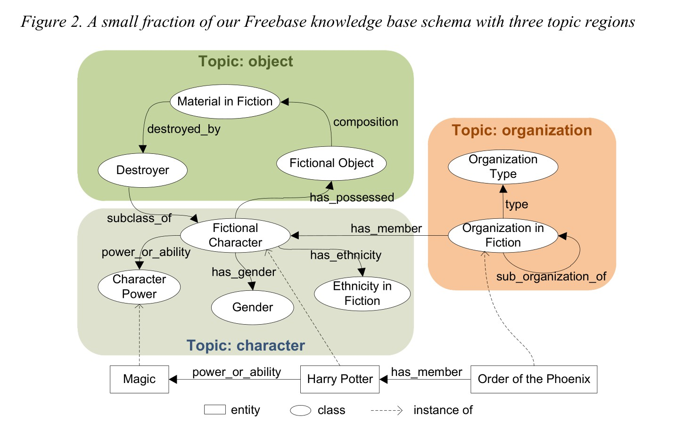

$$
C_A(S_i)=\frac{|E_i|}{L_A+1}\tag{2}
$$

其中$E_i=\{e|e \in E_A \and typeOf(e) \in {S_i}\}$包含了主题$S_i$中的实体，同时$typeOf(e)$表示实体$e$的类。

事实上，纲要层面的主题区域，既可以让用户通过本体虚拟化工具来区分，也可以通过类的来源进行分析。

### 关系复杂度

在一个像Freebase这样大的链接数据集中，两个实体间的关系往往会很复杂，也有它自己的属性。一种在本体工程中的典型解决方案是创建一个虚拟关系结点来表示这样一个复杂的关系，同时也将这个属性联系到这个结点上。图3给一个复杂关系结点举了例子。我们用复杂关系结点的占比来定义$A$上的一个实体关联的关系复杂度$PC_A$:

$$
PC_A=\frac{|M|}{L_A+1}\tag{3}
$$

其中$M=\{e|e \in E_A \and e$ is a complex relation node$\}$。

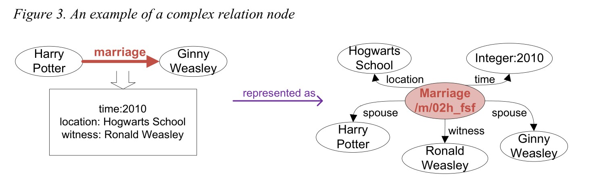

### 属性频率特征

一条语义关联中，一个属性的出现频率是关于这个属性稀有度和常见度的一个很重要的度量。例如，在我们的Freebase数据集中，对于一个组织Order of the Phoenix，它有十一条has_member属性和一条has_founder属性，这表明has_member是一个常见属性，而has_founder很稀有。每个属性在整个语义关联中的出现频率共同决定了它们的稀有度和常见度。假设给定一条$e_x$到$e_y$的属性，我们将其表示为$p_i:(e_x,e_y)$，定义$p_i$的传入频率和传出频率为：

$$
f_{out}(p_i)=\frac{|P_i^{out}|}{d_{out}(e_x)}\tag{4}
$$

$$
f_{in}(p_i)=\frac{|P_i^{in}|}{d_{in}(e_y)}\tag{5}
$$

其中$P_i^{out}=\{p|p:(e_x,e)\and typeOf(p)=typeOf(p_i)\}$，$P_i^{in}=\{p|p:(e,e_y)\and typeOf(p)=typeOf(p_i)\}$，$e$是任意的实体，同时$typeOf(p)$表示属性$p$的类；$d_{in}(e)$和$d_{out}(e)$分别表示e的入度和出度。

用$A$表示实体$e_x$和$e_t$之间的一个语义关联，$d_{in}(e_s) = 0$，$d_{out}(e_t) = 0$，$PF_A=\{f(p)=f_{in}(p)+f_{out}(p)|p \in P_A\}$，我们用四个统计特征(平均值，标准差，最小值和最大值)来衡量整个$A$的属性频率 : 

$$
F_A^p=\{\mu(PF_A),\sigma(PF_A),\min(PF_A),\max(PF_A)\}\tag{6}
$$

### 知名度特征

一个实体指入和指出的属性数目可以被认为是对其知名度的刻画(Aleman-Meza et al., 2005)。一个拥有许多知名实体的语义关联看起来似乎也很知名。假设$D_A=\{d(e)=d_{in}(e)+d_{out}(e)|e \in E_A\}$，像等式(6)一样，我们也用以下的统计特征来描述一个语义关联$A$的知名度 : 

$$
F^e_A=\{\mu(D_A),\sigma(D_A),\max(D_A),\min(D_A)\}\tag{7}
$$

### 特征向量

基于以上部分定义的特征，我们定义一个语义关联$A​$的特征向量为

$$
\pmb x_A=(L_A,C_A(S_1),\dots,C_A(S_k),PC_A,\\
\mu(PF_A),\sigma(PF_A),\min(PF_A),\max(PF_A),\frac{\mu(D_A)}{\max(D_A)},\frac{\sigma(D_A)}{\max(D_A)},\frac{\min(D_A)}{\max(D_A)})\tag{8}
$$

其中$k$是纲要中的子域数量。每个特征向量$\pmb x$都对应着一个$k+9$维的特征空间$\pmb X$。

## 排序学习

### 排序框架

我们系统的核心是一个机器学习的排序算法。算法学习通过特征向量学习用户们的偏好，然后为每个用户生成个性化的排序函数。为了收集训练样本，对于每个单独的用户，我们都让他给询问$q_i$得到的语义关联排序，$q_i$从一个很小的集合里随机选出的查询，$q_i \in Q$。每个语义关联搜索结果的特征向量$\pmb x_i$都被和用户给它的标记排名$r_i^*$结合在一起。一个训练样例是给予随机选择的查询$q_i$由所有这样对子组成的 : 

$$
\pmb S(q_i)=\{(\pmb x_1,r_1^*),(\pmb x_2,r_2^*),\dots,(\pmb x_n,r_n^*)\}\tag{9}
$$
给定训练集$\pmb D=\cup \pmb S(q_i)$，我们的目标是学习出一个线性排序函数$h:\pmb X \mapsto \pmb R$，它利用特征向量来计算分数

$$
h(\pmb x)=\pmb w^T \cdot \pmb x\tag{10}
$$
其中$\pmb w$是与$\pmb x$等长的一个向量。向量$\pmb w$是基于每个独立的用户学习的，与之对应的个性化排序函数会被用到用户的一系列查询中去。给定一个查询返回的一列语义关联，我们首先对每个语义关联通过在它的特征向量上作用$h$函数来计算分数，然后基于这些分数来给整个列表排序。自此，一个基于用户偏好的个性化排序就完成了。

### 排序SVM算法

我们选择在学习过程中采用成对的机器学习排序算法，因为 : 第一，成对的机器学习排序算法受益于先进的二分类器，并且这对于我们的问题也足够了；第二，在我们这个场景中成对机器学习排序算法的偏斜贡献问题 (Liu, 2009)并不存在，因为我们训练集中的训练样例有固定大小(详情参见**评估**部分)。

特别的，对于从相同的训练样例中$\pmb S(q_i)$中一对用户排序的关联$(\pmb x_u,r_u^*)$和$(\pmb x_v,r_v^*)$，我们比较它们的排名，同时定义偏好值
$$
y_{u,v}=\left\{
\begin{aligned}
1 & = & if \quad{r_u^*\gt r_v^*}, \\
-1 & = & otherwise
\end{aligned}
\right.\tag{11}
$$

因此，排序问题被化归为一个二分类问题，目标分类函数$h^*(\pmb x_u,\pmb x_v)=y_{u,v}\in\{\pm1\}​$。我们采用一个软边界的支持向量机(SVM)算法(Cortes & Vapnik, 1995)来学习一个线性分类器，它会尽可能清晰地在$X\times X​$的空间上区分正样本和负样本，同时像图4示例的那样，在它们之间保留尽可能大的边界。

在我们的排序问题中，正样本和负样本总是被成对创建，例如$h^*(\pmb x_u,\pmb x_v)=-h^*(\pmb x_v,\pmb x_u)$，这也同样适用于超平面$L:\pmb x_u=\pmb x_v$。因此，分类平面总是包含超平面$L$，这也可以被表示成这样的形式$L_c:(\pmb w,-\pmb w)^T\cdot(\pmb x_u,\pmb x_v)=0$；其中$\pmb w$是被SVM算法学习出来的未知变量。分类问题等价于分别计算$\pmb w\cdot\pmb x_u$和$\pmb w\cdot\pmb x_v$两个分数然后比较它们。排序结果被表示成对所有的语义搜索结果计算$h(\pmb x)=\pmb w^T\cdot\pmb x$并排序。

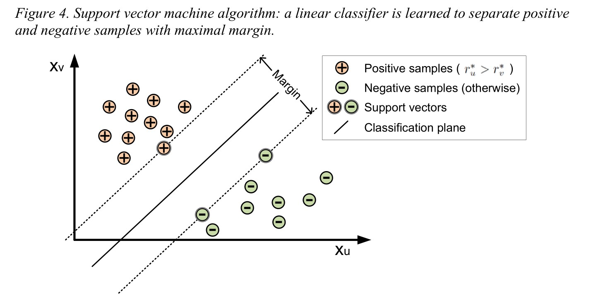

### 用户偏好和权重向量

线性排序函数$h$也可以被看成是特征向量的加权和。权重向量$\pmb w$反映了对于特定用户，每个特征的重要性。因为$\pmb w$是按用户学习的，不同的用户可能会有不同的权重向量。特定特征的权重代表了对于这个用户，这个特征的重要性，或者说，用户关于这个特征的偏好。表2给出了三个不同用户的偏好，其中用户1和用户2对于含有复杂关系的语义关联特别感兴趣，但用户3对于特定子域的结果非常感兴趣。

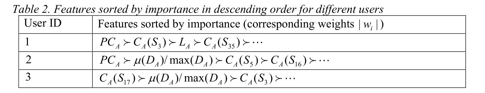

### 系统实现

为了验证我们排序方法的有效性，我们设计实现了这个语义关联查询和排序系统，如图5所示。它由五个部分组成 : 

1. **数据模块** : Freebase的原始数据是用.tsv文件的形式表现的。我们创建了一个解析器来自动把Freebase数据解析成一个大的RDF数据集。
2. **用户模块** : 用户可以对系统进行三种操作 : (1)初始化一个关于一对资源实体的语义关联查询;(2)查看查询的个性化排序结果;(3)通过给用户最喜欢的对于一个训练查询的结果分配排名来训练系统以更好地理解用户偏好。
3. **查询模块** : 查询过程采集输入的一对资源实体，然后通过RDF数据集查询它们之间的所有语义关联。
4. **排序模块** : 特征计算部分对于每个查询结果计算了在**语义关联特征**部分定义的特征。个性化排序函数采集到结果的特征，然后根据用户偏好给它们排序。
5. **学习模块** : 训练数据由对于一个训练查询的用户排好的结果和这些结果的特征组成。为了防止排序函数的偏斜(会在**评价**部分详细介绍)，一些没排序的结果和他们的特征也会被选择。我们采用了一个软边界的支持向量机 (Joachims, 2002)来实现我们的排序SVM算法。

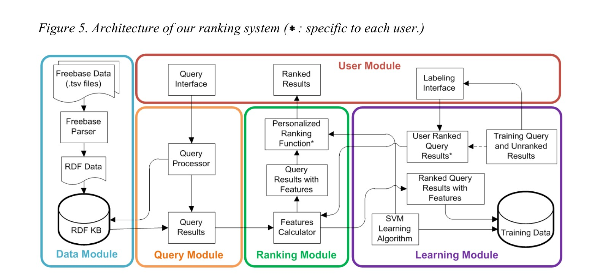

##评价

在我们的排序方法中，合并学习能力的目标是提升每个用户和语义关联查询结果的相关性。基于这个目标，我们在个人用户的排序和总的排序质量两个方面，评价了我们在**实现**章节所提出的排序系统的方法。特别的，我们在不同的数量级和质量级度量下比较了我们的和两个其他方法的排序质量。

### 经验建立

#### 基准

我们的测试建立在一台消费者级别的笔记本电脑上(Intel i-7 CPU 1.60Ghz 以及 6GB内存)。我们的数据集是我们从Freebase链接数据的小说世界领域中创建的RDF知识库。这个RDF知识库覆盖了所有类型的小说作品的信息，尤其是他们之中出现过的人物和组织。我们的数据集包含了192K个实体(185K个正常实体结点 和 7K个复杂关系结点)以及411K个属性。我们的RDF知识库的纲要可以在Freebase纲要资源管理器(2011)中获取。此外，我们的数据集覆盖了从不同方面描述小说世界领域的36个主题。表3展示了包含最多实体的10个主题。

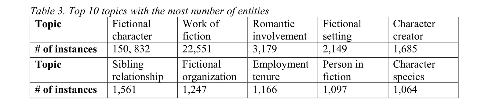

对于每个语义$q_i$，我们的搜索引擎采用了深度限制的搜索算法来寻找长度小于给定界$\delta$的满足$q_i$的语义关联。搜索引擎随后返回前$K$个结果作为结果集合$T(q_i)$。在我们的经验中，我们选择长度不超过10的前2000个结果，也就是说$\delta = 10, K = 2000$。

#### 排序方法比较

我们将我们的方法(LtR)和两个其他方法:baseline(基准)和LtR_CA做了对比。baseline方法是(Aleman-Meza et al., 2005)中展示的。这个方法定义了一系列语义关联特征，同时要求用户手动设置特征权重。我们采用了在它的官方实现((SemDis Project, 2011))推荐的权重设置。我们的权重集合，以及baseline的权重集合都使用了关联长度和主题特征。但是对于主题特征，我们分析了类的来源信息以此决定主题区域，而不是让用户来区分他们。两个特征集合中的其余特征均不相同。为了确保我们评价的可靠性，我们同时测试了我们的使用了baseline中特征的排序学习框架。这个方法被命名为LtR_CA，其中的特征权重将由我们的SVM排序模型学习出来。

需要注意的是，我们并没有将SemRank(Anyanwu et al., 2005)加入比较，原因有：首先，SemRank的排序标准并不基于语义关联的特征，但我们的方法(LtR)，baseline方法，LtR_CA都是基于特征的方法；其次，SemRank目标是为用户提供一个在**传统**和**发掘**之间聚焦于不同角度的工具，而我们的工作重点在于捕获不同的用户偏好。因此，我们没有在对比中包括SemRank。

#### 训练和测试查询

我们邀请了20位研究生参与我们的评价。对于绝大多数我们的参与者都知道的小说**哈利波特**，我们设计了一个查询**哈利波特**的人物之间关系的，有30个查询的集合。表5中展现了整个查询集合以及细节的统计信息。对于每个用户，随机从查询集合中挑选$q_1$~$q_{10}$10个查询。用户需要给10个查询的结果集合$T(q_1)$~$T(q_{10})$标排名。特别的，对于每个结果集合来说，用户需要阅读完整个结果集合，然后挑选出10个最有趣的结果，并基于他的偏好给这10个结果排名。为了考虑未排名的结果的影响，我们随机抽取了$M$个未排名结果并把它们排为第11名，这就额外增加了$10M$对结果，目的是确保获得排名的结果一定比未排名结果更好。这些结果对比前10的结果之间更有作用，但同时它不应该影响到训练集。因此，我们根据经验选取了$M=5$，也就是说，每个标号的结果集$S(q_i)$包含15个结果。最后，从10个查询$q_1$~$q_{10}$中，我们随机选取了5个作为训练，5个作为测试。

### 排序结果

图6包括了我们实现中的四个截图。它展示了我们的方法和baseline在同一个查询的两个不同用户上的排序结果(例如，在**金妮韦斯莱**和**秋张**之间查询语义关联)。每个截图都给出了某个用户使用某种方法的六个排名最高的结果。 我们的方法在捕获用户偏好方面展现出巨大的优势。对于用户1，我们的方法得出的前六个结果成功捕获到了他最喜欢的六个结果；但是baseline却像图中显示的那样只找到了两个，排名也较低。对于用户2，她最喜欢的十个结果baseline一个都没有找到，但是我们的方法依然成功找到了她第一和第二喜欢的结果。

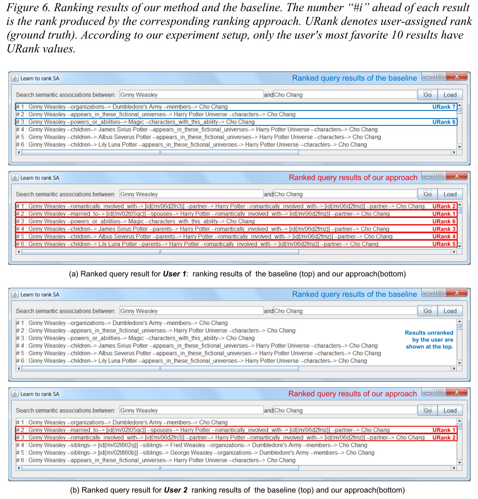

###比较1 : 每个用户的排序质量

我们从对于单个用户捕获用户偏好的有效性比较了我们的排序方法(LtR)，baseline方法和LtR_CA的排序质量，比较基于以下的度量标准 : 

1. **时间复杂度** 

   训练过程仅仅过了几秒，并且对每个用户只进行了一次。换句话说，一旦个性化排序函数被学习出来了，对于所有的查询，它跑的就像一个线性求和函数一样快。在这个测试中，对于所有的三种方法，绝大多数的时间都用来寻找路径，这需要好几秒。额外的开销，例如特征分析和排序，耗时都很小。

2. **累计损失比例** 
   $$
   r_{loss}=\frac{1}{N_L}\cdot L=\frac{1}{N_L}\sum_{(u,v)}L(h;\pmb x_u,\pmb x_v,y_{u,v})=\frac{1}{N_L}\sum_{(u,v)}\frac{|h(\pmb x_u,\pmb x_u)-y_{(u,v)}|}{2}\tag{12}
   $$
   其中，$L$是一个用户的排序函数的累计损失比例，$N_L$表示所有的比较对。特别的，$L$统计了在所有的测试查询中，相对于基本事实(用户标记的排名)，排序函数生成的排名里被交换的对数。累计损失比例$r_{loss}$可以被看成是线性分类器的失准率。我们用$r_{loss}$来衡量用户偏好的捕获质量。$r_{loss}$越小，排序函数对于用户偏好的捕获就越精准。

   图7展示了对于所有的用户，三种方法的累计损失比例。LtR和LtR_CA的损失比例总是比baseline方法要优。总的来说，像表4展示的那样，LtR的平均损失比例比LtR_CA更好。然而，我们发现对于所有的用户，LtR并不总是比LtR_CA要好。这是因为有的用户对于我们的独家特征并不怎么感兴趣，例如属性复杂度。对应的，他们对我们的方法和Aleman-Meza et al. (2005)中的共同参数很感兴趣，例如文本复杂度。对于这类用户，因为用的是一样的排序学习算法，两种方法获得的损失比例差不多。

   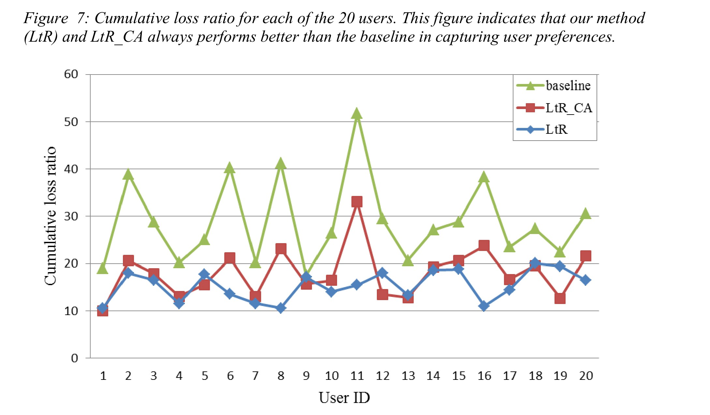

   3. **用户结果前10的总排名**
      $$
      S=\sum_{s\in U}rank(s)\tag{13}
      $$
      其中，$U$代表对于给定的查询，用户最喜欢的10个语义关联构成的集合。这个指标代表用户需要多少结果才能获得他最喜欢的10个结果。他通过识别用户最感兴趣的结果来评估一个排序方法的有效性。$S$越小，排序函数越有效。

      图8展示了20个用户最喜欢的10个结果的总排名。我们的方法在捕获用户最喜欢的10个结果上，总是比baseline更好，同时对于绝大部分的用户，也比LtR_CA更好。

      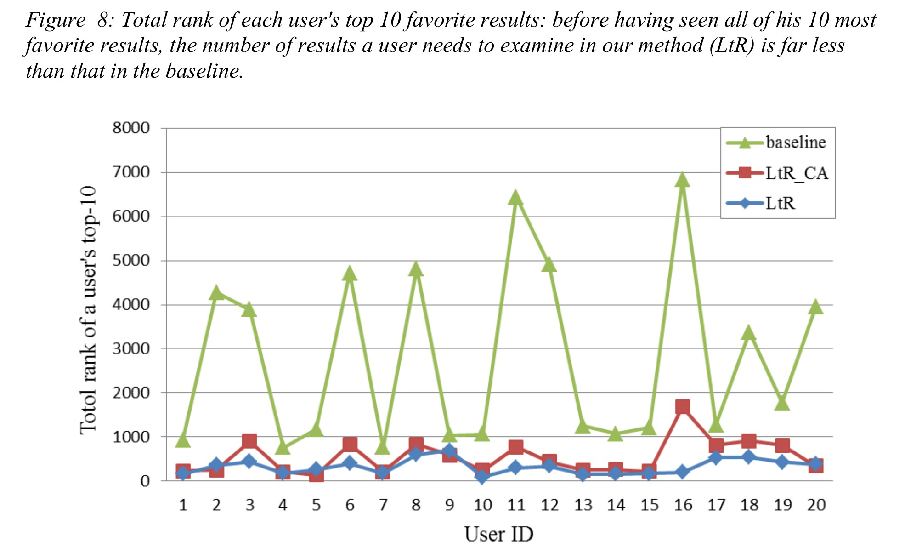

### 比较2 : 总体排序质量

除了评价基于个体用户的结果，我们也对三个方法的总体排序质量进行了评估。我们采用了两个标准的信息获取度量标准 : k准率和$nDCG_k$(Järvelin & Kekäläinen, 2000)。为了基于这两个标准做一定数量的评价，我们随机创建了20个额外的查询。每个用户被要求对每个方法为他生成的结果判断是否属于前10，同时分别给每条计路打一个六个分段的分，从0(坏)到5(完美)。如果一条记录获得3分(好)及以上，则被认为是相关的，否则认为无关。我们收集了12000条带用户判断的记录，然后用两个度量标准来评价三个方法：

k准率 : 表征了算法给出的前k个结果里相关结果的比例。

$nDCG_k$ : 归一化累计获得损耗在k处的值是

$$
nDCG_k = M_k\sum_{i=1}^k\frac{2^{r_i}-1}{log_2(1+i)}\tag{14}
$$
其中$M_k$是一个确保$nDCG_k$在完美情况下取值为1的归一化分数。$nDCG_k$被专门设计出来用于评价排序的结果。相比于前k个结果里面的无关项，他给予相关项更大的奖励值(Agichtein et al., 2006)。

图9和图10说明在三种方法中，我们的方法(LtR)对于前10个结果总是有最好的准确率和$nDCG$值。

此外，我们计算了**累计损失比例**和**用户结果前10的总排名**作为评价总体排序质量的另外两个标准。表4包含了这个部分里评价结果的所有四个标准，也说明我们的方法从四个标准的角度来说总体排序质量都是最好的。

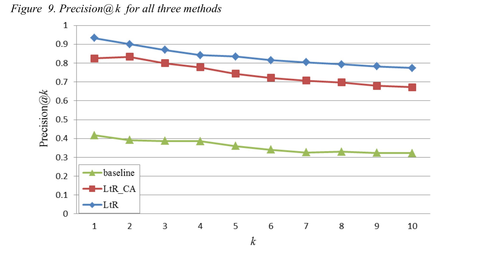

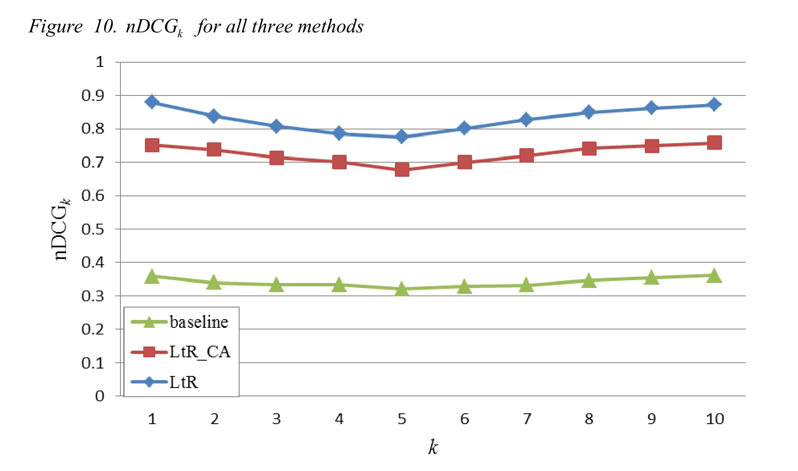

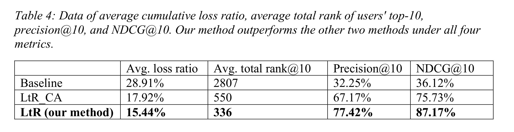

## 总结和未来工作

在这篇文章中，我们提出了一个用于排序语义关联搜索结果的排序学习方法。我们使用一个特征向量来表征每个语义关联。对于每个用户，一个个性化的排序函数会被通过学习他在这些特征上的偏好创建出来。我们使用了不同的度量标准和一个真实世界的数据集评价了单个用户以及总体的排序质量。和时下最好的结果相比，我们的方法在准确率和有效性上表现出很大的提升。

我们为了的工作主要由三个方向。首先，我们会开发一个交互式的排序学习系统，使得用户可以持续改善排序结果。特别的，这个系统允许用户对当前的排序结果进行简单反馈，从反馈中学习用户当下的偏好，并且把这些偏好合并到排序函数中去。其次，我们会使用更大的训练和测试数据集用以评价。最后，我们计划采用别的机器学习排序算法来对语义关联排序。

## 附加内容

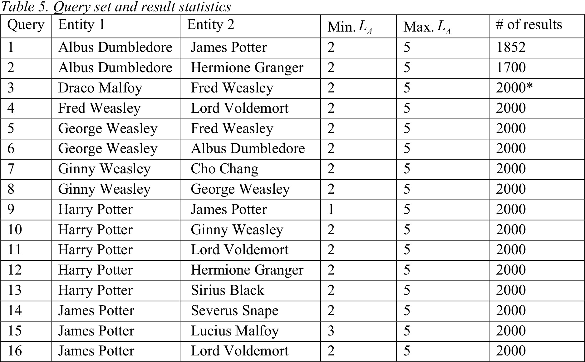

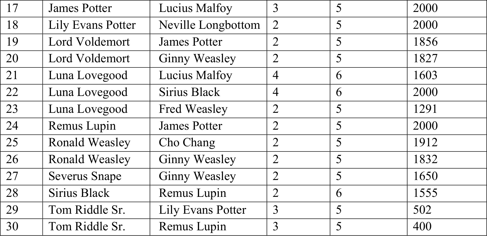

** : 在我们的实验中，我们从长度不超过10的结果中选取了前2000个。